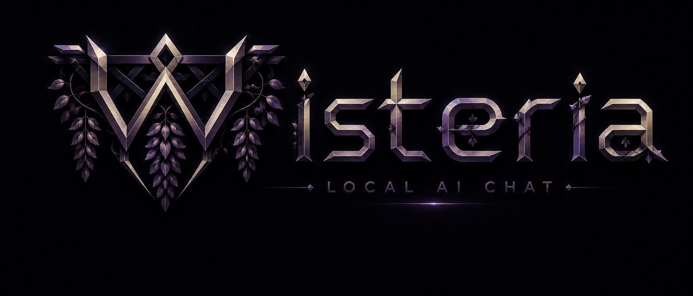

<h1 align="center">Wisteria</h1>

<p align="center"><strong>A privacy-first AI companion platform that lives entirely on your machine - encrypted memory, a cloned voice, vision, and a frosted-glass UI. Not a single byte leaves your PC.</strong></p>

<p align="center">
  
  
  
  
  
</p>

<p align="center">
  
</p>

---

Wisteria is a native desktop chat app (pywebview + WebView2) driving a local
`llama-server` for text + vision and a dedicated Chatterbox worker for speech.
Everything sensitive - long-term memory **and every prompt text** - is born
inside a passphrase-encrypted database. There is no cloud, no telemetry, no
account, and nothing readable at rest.

It ships with **Wisteria**, the default companion character (she's the one in
the logo). Create your own characters and personas in-app; they are stored
encrypted like everything else.

## Features

- **Encrypted vault** - AES-256 SQLite (SQLite3 Multiple Ciphers) keyed by a
  scrypt-derived passphrase that is never stored. System/character/persona
  prompts and all memory live inside it; a one-time migration absorbs any
  plaintext prompt files and deletes them (verify-then-delete, atomic).
- **3-tier long-term memory** - rolling recap + durable fact ledger +
  episodic vector recall (sqlite-vec, multilingual embeddings on CPU), with
  quote-or-drop verification so small local models can't drift the record.
- **Voice** - expressive zero-shot cloning (Chatterbox) running as a resident
  subprocess in its own venv. Auto-speak toggle, per-message ▸ playback,
  WSOLA time-stretch, live tuning (speed / denoise / emotion) from the UI.
  Clone any voice **you have consent to use** by dropping a reference clip.
- **Vision** - two-call flow: a neutral observation pass feeds a grounded,
  in-character reaction. Adaptive image-token budget up to full detail.
- **`/ara` offline research** - evidence-only web lookups through a local
  SearXNG pipeline, anonymized and no-trace by design.
- **Dual-model VRAM design** - LLM and voice are resident together; measured
  headroom on a 16 GB GPU (see budget below). Serial boot, job-object
  lifetime: no orphan processes, no VRAM leaks.
- **Glass UI** - GMK-Violet-inspired frosted panels with a neon edge accent,
  passphrase lock screen, in-app encrypted prompt manager (create / rename /
  edit / activate / delete characters and personas), voice settings panel,
  reader-friendly smart autoscroll with a jump-to-bottom pill, per-message
  copy and speak, confirmed new-chat (Ctrl+N), one-click chat export to .txt.
- **Living memory panel** - live-refreshing overview (recap + facts), search,
  in-place fact editing, manual "remember this" entries with importance, and
  per-fact forget - all against the encrypted store.
- **Personalization** - custom chat background from any image with a
  focal-point crop that stays anchored when the window is resized, automatic
  light/dark text switching with adjustable contrast and tint, and message
  font size / line-height controls.
- **Generation controls** - the loaded model's real identity and limits are
  measured from the server (params, size, trained context, vision); sampling
  (temperature / top-p / top-k / min-p / repeat penalty / max tokens) applies
  live, and the context-window size restarts the sidecar safely with an
  automatic revert if the new size does not fit in VRAM.
- **Fails loudly, never silently** - structured local logging (content-free
  by policy), a circuit breaker with backoff on the memory pipeline,
  crash-safe vault recovery (the DB itself is the source of truth for the
  key), atomic settings writes with corrupt-file backup, and a 13-suite
  regression harness (`python tests/run_all.py`).

## Architecture

```
┌────────────────────────── Wisteria.exe (pywebview / WebView2) ───────────────────────┐
│  web/  (vanilla HTML·CSS·JS, strict CSP)                                             │
│    └── window.pywebview.api  ←→  JsApi (backend/api.py)                              │
│                                   │                                                  │
│         ┌─────────────────────────┼──────────────────────────┐                       │
│         ▼                         ▼                          ▼                       │
│  llama-server.exe          tts_worker.py                encrypted vault              │
│  (sidecar, 127.0.0.1,      (Chatterbox, own venv        (memory/mem.db, AES-256:     │
│   api-key, --offline)       tts_env/, JSON pipes)        memory + prompts)           │
└──────────────────────────────────────────────────────────────────────────────────────┘
              all traffic loopback-only · no outbound connections at runtime
```

## Quick Start

### Prerequisites

- Windows 11, Python 3.12+, [uv](https://github.com/astral-sh/uv)
- NVIDIA GPU (developed & measured on an RTX 5080 16 GB, CUDA 12.8)
- [llama.cpp](https://github.com/ggml-org/llama.cpp) server binaries in `../llama_cpp/`
- A GGUF chat model (+ optional mmproj for vision) in `../Models/`

### Install & run

```bash
# 1) app dependencies
uv sync

# 2) (optional) voice - builds the dedicated tts_env with CUDA 12.8 torch
install-tts.bat

# 3) run (dev)
run-app.bat
```

First launch asks you to create a passphrase; it encrypts everything and is
never written anywhere. Forgetting it means the vault is gone - by design.

### Model setup

```
local_llm_inference_gpu/
├── Models/
│   ├── your-model-Q4_K_M.gguf        # any llama.cpp-compatible GGUF
│   └── mmproj-....gguf               # optional: vision projector
├── llama_cpp/
│   └── llama-server.exe
└── wisteria-app/                      # this repo
```

Name your model `model.gguf` (and projector `mmproj.gguf`), or set your own
file names in `settings.json` next to the app (created on first run,
git-ignored - which model you run stays your business):

```json
{ "model_file": "your-model.gguf", "mmproj_file": "your-mmproj.gguf" }
```

Compatible with standard and **abliterated / uncensored GGUF builds** alike -
the app is model-agnostic.

### Prompts (your character, your rules)

Prompts are managed **inside the app** and stored encrypted - there are no
plaintext prompt files at rest. Starter templates live in [`examples/`](examples/):

| File                          | Purpose                                        |
|-------------------------------|------------------------------------------------|
| `system_prompt.example.txt`   | Core behavior: realism, craft, output discipline |
| `character.example.txt`       | A complete example companion ("Wisteria")       |

To use them: unlock the app → **⋮ → Promptlar** → paste the system text into
the **Sistem** tab → in **Karakter**, hit **+ Yeni**, name it, paste, **Kaydet**,
then **Aktif yap**. Personas (facts about *you*) work the same way under
**Persona**. Everything you type there is written straight into the encrypted
vault - edit freely, export anytime.

## VRAM budget (measured, RTX 5080 16 GB)

| Component                           | VRAM        |
|-------------------------------------|-------------|
| 12B GGUF @ Q4_K_M, 16k ctx, KV q8_0 | ~8.5 GB     |
| Chatterbox voice worker (fp32)      | ~3.8 GB     |
| **Free headroom (both resident)**   | **~2.2 GB** |

Boot is serial (LLM first, voice after ready) to avoid cold-start contention;
the speaker toggle never unloads the worker, so re-enabling is instant.

## Privacy contract

| Guarantee                                  | How                                              |
|--------------------------------------------|--------------------------------------------------|
| No cloud, no telemetry                     | ✅ runtime is fully offline; `--offline` sidecar |
| Loopback only                              | ✅ `127.0.0.1` + API key on the LLM sidecar      |
| Memory encrypted at rest                   | ✅ AES-256 full-DB (schema included)             |
| Prompts encrypted at rest                  | ✅ same vault; plaintext migrated then deleted   |
| Passphrase never stored                    | ✅ scrypt-derived key, RAM only                  |
| Optional device unlock                     | ✅ Windows DPAPI, off by default                 |
| Web research anonymized                    | ✅ local SearXNG, evidence-only, no-trace        |
| Voice/reference audio never leaves the box | ✅ local synthesis; clips are git-ignored        |
| Nothing personal in this repo              | ✅ vault, settings, voices, caches git-ignored   |

## Project structure

```
wisteria-app/
├── main.py                 # window, DPI, single-instance, serial boot
├── backend/
│   ├── api.py              # JsApi core (bridge lifecycle, status, streaming glue)
│   ├── api_parts/          # feature mixins: chat, memory, prompts, tts, prefs, gen
│   ├── server.py           # llama-server lifecycle (job object, health)
│   ├── tts.py / tts_worker.py       # thin client ↔ resident Chatterbox subprocess
│   ├── prompts.py / prompt_store.py # encrypted prompt provider + migration
│   ├── memory/             # crypto (scrypt/DPAPI), store, embedder, manager
│   ├── logutil.py          # local rotating log (content-free by policy)
│   └── vision.py / research.py / images.py / sanitize.py / llm.py
├── web/                    # index.html · app.css · app.js (no frameworks)
├── assets/                 # icon, brand sheet, version resource
├── tests/                  # headless suites (run: python tests/run_all.py)
├── install-tts.bat / run-app.bat / build-exe.bat
└── pyproject.toml
```

## Packaging

```bash
build-exe.bat   # PyInstaller onedir → Wisteria.exe + _internal\ (placed in-app)
```

Onedir was chosen deliberately: fast cold start and far fewer antivirus
false-positives than a self-extracting onefile. The exe shares the same vault,
settings and voice environment as dev - one identity, two entry points.

## Roadmap

- ✅ Encrypted memory + prompt vault, in-app management (create/rename/delete)
- ✅ Voice cloning with live tuning, per-message playback
- ✅ Vision, offline research, packaged build
- ✅ Custom chat backgrounds (focal-point crop, adaptive text contrast)
- ✅ Live memory panel with search, manual facts and in-place editing
- ✅ Generation settings panel (sampling + context size, server-measured limits)
- ✅ Reliability overhaul: vault self-recovery, atomic settings, bounded
  retries everywhere, full regression test suite
- ⏳ Persistent chat history (encrypted, browsable sessions)
- ⏳ Voice input (local Whisper STT)
- ⏳ Brand dark theme for the UI

## License

Personal project - all rights reserved. No redistribution of bundled models,
voices, or brand assets.
